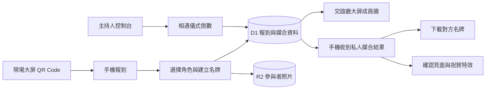

<div align="center">

# 🧙 巫師公會交誼廳

### Freedom Party Guild Lounge

自由派對的現場報到、角色識別卡、大屏互動與即時社群媒合系統。

[](https://freedom-party-guild-lounge.cybermonk.chatgpt.site)


**[開啟正式網站](https://freedom-party-guild-lounge.cybermonk.chatgpt.site)** · **[參與者手機報到](https://freedom-party-guild-lounge.cybermonk.chatgpt.site/?surface=checkin)**

</div>

---

## 專案簡介

巫師公會交誼廳把活動中最容易冷場的三個環節整合成一套體驗：**進場報到、公開自我介紹、現場認識新夥伴**。

參與者用手機掃描現場大屏 QR Code，選擇角色並建立個人識別名牌。完成報到後，名牌會同步到交誼廳大屏並進入媒合候選名單。主持人啟動「相遇儀式」後，系統會在仍在線且同意媒合的參與者之間分配一位不同的夥伴，結果只會顯示在各自手機上。

這不是一張靜態報到表。它是一個讓陌生人更容易開始對話的現場互動系統。

## 核心體驗



### 參與者流程

1. 掃描大屏 QR Code，進入公開手機報到頁。
2. 選擇公會角色，拍攝照片並填寫暱稱、技能與一句召喚。
3. 預覽識別名牌，自主選擇是否登上大屏及參與媒合。
4. 完成報到，資料同步至大屏與媒合資料庫。
5. 主持人啟動倒數後，保持活動頁開啟等待媒合結果。
6. 查看對方名牌與破冰題目，下載對方識別名牌並在現場找到彼此。
7. 按下「我們已經見面」，獲得祝賀動畫與完成回饋。

### 主持人流程

1. 使用私密工作人員連結開啟交誼廳大屏與主持人控制台。
2. 確認現場大屏 QR Code 正確顯示，等待參與者完成報到。
3. 在控制台查看報到人數、在線人數、角色分布與媒合意願。
4. 選擇倒數時間並啟動相遇儀式。
5. 倒數結束後，確認大屏與參與者手機進入媒合完成狀態。
6. 活動結束後，透過控制台清除所有報到、照片與媒合資料。

## 四種公會角色

| 角色 | 現實身份 | 在公會中的力量 |
| --- | --- | --- |
| ⚙️ **機甲師** | 工程師、技術創作者 | 把想像鍛造成真正能運作的工具與系統 |
| ✦ **幻術師** | 設計師、視覺創作者 | 把感受轉化為畫面、體驗與引人靠近的幻象 |
| ◉ **召喚師** | 媒合者、策展人、社群經營者 | 連結人物、資源與機會，讓新的關係發生 |
| ♛ **城主** | 企業主、出資者、資源提供者 | 提供場域與資源，讓值得的創作持續長大 |

## 三個產品介面

| 介面 | 使用者 | 主要用途 | 存取方式 |
| --- | --- | --- | --- |
| **手機報到** | 活動參與者 | 建立名牌、完成報到、接收媒合、下載對方名牌 | 公開網址與現場 QR Code |
| **交誼廳大屏** | 現場所有人 | 顯示 QR Code、成員牆、倒數與媒合完成狀態 | 私密工作人員連結 |
| **主持人控制台** | 主持人與管理人員 | 監看狀態、設定倒數、啟動媒合、清除活動資料 | 私密工作人員連結 |

### 路由

```text
/?surface=checkin   公開手機報到
/?surface=lounge   交誼廳大屏，需要工作人員憑證
/?surface=admin    主持人控制台，需要工作人員憑證
```

> 工作人員網址本身就是操作憑證。請只透過私人管道提供給現場管理人員，不要放進公開文件、社群貼文或參與者 QR Code。

## 功能清單

### 報到與識別名牌

- 手機拍照或從相簿選擇照片
- 暱稱、角色、最多三項技能與一句召喚
- 識別名牌即時預覽
- PNG 名牌下載與 iOS 分享選單支援
- 自主控制是否顯示於大屏及參與媒合

### 大屏與現場互動

- 只導向手機報到頁的專用 QR Code
- 即時報到成員牆與角色人數統計
- 相遇儀式倒數畫面
- 媒合完成人數與現場對話提示
- 零資料狀態，不使用公開測試假資料

### 社群媒合

- 僅媒合最近 90 秒仍在線且同意參與的使用者
- 每位符合資格的參與者會收到一位不同的夥伴
- 支援奇數人數，不會把參與者配對給自己
- 媒合結果只提供給對應手機裝置
- 角色專屬破冰題目
- 下載對方的識別名牌
- 見面確認、祝賀動畫、震動回饋與減少動態效果支援

### 主持與資料管理

- 報到、在線、媒合意願與活動輪次統計
- 10 秒、30 秒、1 分鐘與 3 分鐘倒數
- 啟動、完成及重置媒合輪次
- 一鍵清除參與者、照片與所有媒合資料

## 系統架構

| 層級 | 技術 | 職責 |
| --- | --- | --- |
| 前端 | React 19、Vite 6 | 手機報到、大屏、控制台與 Canvas PNG 產生 |
| 視覺 | CSS、Phosphor Icons | 海報式視覺、角色系統、響應式介面與動態效果 |
| 邊緣 API | Cloudflare Worker | 報到、驗證、照片、活動狀態與媒合 API |
| 結構化資料 | Cloudflare D1、Drizzle ORM | 參與者、活動狀態與媒合紀錄 |
| 圖片儲存 | Cloudflare R2 | 參與者照片儲存與提供 |
| 部署 | OpenAI Sites | 靜態資源、Worker、D1 migration 與 R2 binding |

### 資料同步方式

- 手機完成報到後直接寫入 D1，照片另行上傳至 R2。
- 手機每 20 秒送出 heartbeat；伺服器以最近 90 秒活動判斷在線狀態。
- 大屏、控制台與手機使用短輪詢同步活動狀態。
- D1 是參與者與媒合狀態的唯一權威來源；瀏覽器只保存目前裝置的匿名識別資訊。

## 安全與隱私

- **公開入口隔離：** 參與者 QR Code 只能進入手機報到頁，無法直接開啟大屏或控制台。
- **工作人員驗證：** 大屏與控制台使用私密 `HOST_TOKEN` 驗證，正式密鑰不提交至 GitHub。
- **裝置驗證：** 每張參與者名牌綁定裝置 token；伺服器只儲存 SHA-256 雜湊。
- **私人媒合結果：** 參與者只能使用自己的裝置 token 取得自己的媒合結果。
- **照片限制：** 圖片上傳限制為 2.5 MB，儲存於 R2。
- **資料生命週期：** 管理人員可在活動結束後刪除所有參與者、照片與媒合紀錄。
- **最小化瀏覽器資料：** `localStorage` 只保留不透明的參與者 ID 與裝置 token，不作為跨裝置共享資料庫。

## API 概覽

### 公開與參與者 API

| Method | Path | 用途 | 驗證 |
| --- | --- | --- | --- |
| `GET` | `/api/event` | 取得目前活動狀態 | 無 |
| `POST` | `/api/participants` | 建立或更新報到資料 | Participant token |
| `GET` | `/api/participants/:id` | 讀取自己的名牌 | Participant token |
| `POST` | `/api/participants/:id/heartbeat` | 更新在線狀態 | Participant token |
| `POST` | `/api/participants/:id/photo` | 上傳參與者照片 | Participant token |
| `GET` | `/api/matches/me` | 取得自己的媒合結果 | Participant token |

### 工作人員 API

| Method | Path | 用途 |
| --- | --- | --- |
| `GET` | `/api/host/verify` | 驗證工作人員憑證 |
| `GET` | `/api/host/participants` | 取得報到名單與在線狀態 |
| `POST` | `/api/host/event` | 啟動倒數或重置活動狀態 |
| `POST` | `/api/host/complete-round` | 完成目前媒合輪次 |
| `DELETE` | `/api/host/reset` | 清除報到、照片與媒合資料 |

所有工作人員 API 都需要 `Authorization: Bearer <HOST_TOKEN>`。

## 本機開發

### 環境需求

- Node.js 22 或相容版本
- npm

### 安裝與啟動

```bash
git clone https://github.com/davidni0729/freedom-party-guild-lounge.git
cd freedom-party-guild-lounge
npm install
npm run dev
```

Vite 開發伺服器可預覽前端介面。需要完整報到、上傳與跨裝置媒合時，必須使用具備 Worker、D1 與 R2 bindings 的 Sites 環境。

本機設計預覽可使用：

```text
/?surface=lounge&staff=1
/?surface=admin&staff=1
```

`staff=1` 只在 Vite 開發模式有效，不會繞過正式站的工作人員驗證。

### 常用指令

| 指令 | 用途 |
| --- | --- |
| `npm run dev` | 啟動 Vite 開發伺服器 |
| `npm run build` | 建置前端並準備 Sites Worker 與 migrations |
| `npm run test:sites` | 執行 Worker、API、媒合與部署檔案測試 |
| `npm run db:generate` | 根據 Drizzle schema 產生 D1 migration |
| `npm run preview` | 預覽正式前端建置結果 |

### 驗證發布內容

```bash
npm run build
npm run test:sites
```

測試涵蓋靜態資源、SPA fallback、API 路由、工作人員權限、真實參與者建立、倒數媒合、奇數人分配，以及 Sites 所需輸出檔案。

## 專案結構

```text
guild-lounge-app/
├── src/
│   ├── App.jsx                    # 三個產品介面與主要互動流程
│   ├── main.jsx                   # React 入口
│   └── styles.css                 # 視覺系統、響應式與動畫
├── worker/index.js                # Cloudflare Worker API 與媒合邏輯
├── db/schema.ts                   # Drizzle D1 schema
├── drizzle/                       # 版本化資料庫 migrations
├── public/assets/                 # 海報與識別名牌視覺資產
├── scripts/prepare-sites-build.mjs
├── tests/sites-worker.test.mjs
├── .openai/hosting.json           # Sites 的 D1/R2 邏輯 bindings
├── design-qa.md                   # 視覺驗證紀錄
└── vite.config.mjs
```

## 部署設定

`.openai/hosting.json` 只保存 Sites 專案 ID 與邏輯資源名稱：

```json
{
  "project_id": "appgprj_6a74b84270d88191bc6a8de9d0c790dd",
  "d1": "DB",
  "r2": "UPLOADS"
}
```

正式環境另外需要一個不提交至版本控制的 runtime secret：

```text
HOST_TOKEN=<private-host-token>
```

## 現場上線檢查

- [ ] 使用工作人員連結開啟大屏與控制台。
- [ ] 用一般手機掃描大屏 QR Code，確認只進入手機報到。
- [ ] 完成一筆報到，確認名牌出現在大屏。
- [ ] 使用至少兩台手機測試倒數與媒合。
- [ ] 確認每台手機只看到自己的媒合結果。
- [ ] 測試對方識別名牌 PNG 下載。
- [ ] 測試「我們已經見面」祝賀效果。
- [ ] 正式開場前清除測試資料。
- [ ] 活動結束後依資料政策清除參與者與照片。

## 目前限制與後續方向

- 目前以單一活動狀態運作，尚未支援多場活動同時管理。
- 狀態同步採短輪詢，不是 WebSocket 即時推播。
- 工作人員權限採私密連結與 token，尚未整合個人帳號登入或角色權限。
- 「已經見面」目前是裝置端體驗回饋，尚未寫入活動分析資料。
- 後續可加入活動代碼、多輪不重複媒合、互動成效統計與資料保留期限設定。

## 文件

- [視覺設計 QA 與驗證紀錄](design-qa.md)

## 專案理念

**自由創造・連結彼此・實驗未來**

好的交流活動不應該只把人放進同一個空間，然後期待關係自然發生。巫師公會交誼廳用角色、名牌、倒數和一個明確的相遇任務，降低第一次開口的成本，讓現場的每一個人都有機會找到值得認識的新夥伴。
